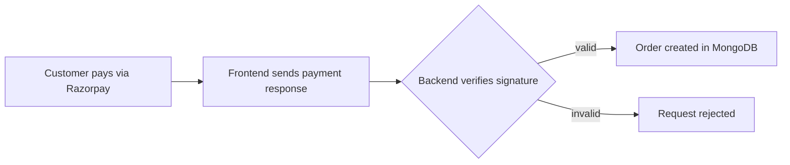

  

  
  
  

I build full-stack web apps that go live: authentication, payments, admin dashboards and maps. B.Tech CSE at Subharti University (2027), solving DSA in Java. Available for internships now, full-time from 2027.

## Shipped

| Project | What it does | Links |
|---|---|---|
| **GenZVibe** | MERN e-commerce: cart, checkout, Razorpay payments with backend signature verification, admin dashboard with sales analytics | [Live](https://genzvibe.onrender.com) · [Code](https://github.com/singhshivamraj/GenZVibe) |
| **Nestio** | Airbnb/OYO-style hotel booking: Passport.js auth, Joi validation, every listing pinned on a map | [Live](https://nestio-1.onrender.com/listings) · [Code](NESTIO_REPO_LINK) |
| **DevCollab** *(in progress)* | Real-time collaborative coding rooms with Socket.IO and Monaco Editor | [Code](DEVCOLLAB_REPO_LINK) |

## How GenZVibe handles a payment

## Toolbox

## Contact

[LinkedIn](https://www.linkedin.com/in/shivam-rajfullstack) · shivamraj6436@gmail.com
