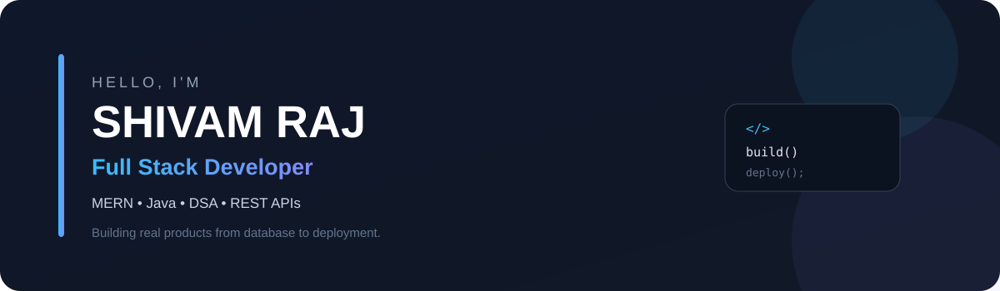

  

  
  
  

 

01 — ENGINEERING PROFILE

Shivam Raj
├── Software Engineer / Full Stack Developer
├── Primary stack     → MERN
├── Programming       → Java · JavaScript
├── Problem solving   → DSA
├── Interests         → Backend · APIs · Payments · Deployment
└── Currently         → Building + shipping real products

I like taking a feature all the way from database schema → API → frontend → deployment.

B.Tech CSE @ Subharti University · Graduating 2027
Available for internships now · Full-time opportunities from 2027

02 — SHIPPED SYSTEMS

<table>
<tr>
<td width="50%" valign="top">

GENZVIBE

MERN E-commerce Platform

A full-stack shopping platform with a real checkout and payment workflow.

Engineering

React + Node.js + Express

MongoDB + Mongoose

Razorpay integration

Backend payment signature verification

Authentication & protected routes

Admin dashboard + sales analytics

Cloudinary image uploads

Deployed on Render

LIVE ↗ · SOURCE ↗

</td>
<td width="50%" valign="top">

NESTIO

Property & Hotel Booking Platform

An Airbnb/OYO-style application focused on listings, authentication and location-based discovery.

Engineering

Node.js + Express

MongoDB + Mongoose

Passport.js authentication

Joi server-side validation

Reviews & ratings

Map-based listing discovery

Search + category filtering

Cloudinary uploads

Deployed on Render

LIVE ↗ · SOURCE ↗

</td>
</tr>
</table>

DEVCOLLAB — currently building

Real-time collaborative coding platform

React · Node.js · Socket.IO · Monaco Editor

Shared coding rooms where developers can write and collaborate on code in real time.

SOURCE ↗

03 — HOW I BUILD

                    ┌──────────────────┐
                    │      PRODUCT     │
                    └────────┬─────────┘
                             ↓
                    ┌──────────────────┐
                    │   React / UI     │
                    └────────┬─────────┘
                             ↓
                    ┌──────────────────┐
                    │ REST API / Auth  │
                    │ Node + Express   │
                    └────────┬─────────┘
                             ↓
                    ┌──────────────────┐
                    │ MongoDB / Data   │
                    └────────┬─────────┘
                             ↓
                    ┌──────────────────┐
                    │ Cloud / Deploy   │
                    └──────────────────┘

I care about the part between "it works locally" and "it actually works as a product."

04 — ENGINEERING SPOTLIGHT

GENZVIBE / PAYMENT PIPELINE

The frontend does not decide whether an order is paid.

Customer
   │
   ▼
Razorpay Checkout
   │
   ▼
Payment Response
   │
   ▼
Backend API
   │
   ▼
Signature Verification
   │
   ├──── invalid ────► Request rejected
   │
   ▼ valid
Create Order
   │
   ▼
MongoDB

Key idea: an order is created only after the backend verifies the Razorpay payment signature.

05 — TOOLBOX

  

Area

Stack

Frontend

React · Redux · JavaScript · Tailwind CSS

Backend

Node.js · Express · REST APIs

Database

MongoDB · Mongoose

Programming

Java · JavaScript · DSA

Auth

JWT · Passport.js · Sessions

Integrations

Razorpay · Cloudinary

Tools

Git · GitHub · Postman

06 — CURRENT BUILD

[████████████████████░░]  DEV COLLAB

Real-time coding rooms
        +
Socket.IO synchronization
        +
Monaco Editor
        ↓
Collaborative developer workspace

07 — WHAT I'M LOOKING FOR

SDE · Full Stack Developer · MERN Developer · Software Engineering Internships

I want to work on products where I can contribute across the stack, learn from experienced engineers, and ship software that real users can use.

 

BUILD → DEBUG → SHIP → IMPROVE

  

<a href="https://www.linkedin.com/in/shivam-rajfullstack">LinkedIn</a>
  ·  
<a href="mailto:shivamraj6436@gmail.com">Email</a>
  ·  
<a href="https://github.com/singhshivamraj">GitHub</a>

