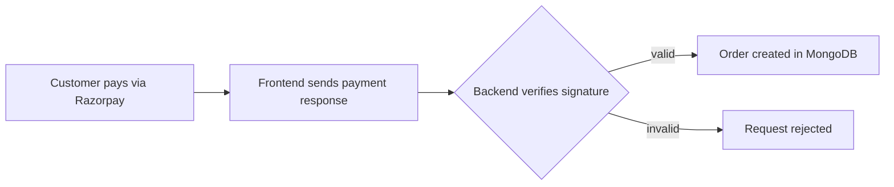

<h1 align="center">Hi, I'm Shivam 👋</h1>

  

  
  
  

---

### 🧭 The short version

I build full-stack web apps that actually go live: logins, payments, admin dashboards and maps. B.Tech CSE at Subharti University (2027). Powered by chai, Java and one more deploy.

Available for internships now, full-time from 2027.

---

### 🚀 What I've shipped

<b>🛍️ GenZVibe</b>: MERN e-commerce platform

 

- Cart, secure checkout, order tracking and an admin dashboard with sales analytics
- JWT auth, bcrypt hashing, role-based protected routes
- Razorpay payments with backend signature verification
- Images on Cloudinary, deployed on Render with MongoDB Atlas

[🌐 Live demo](https://genzvibe.onrender.com) · [💻 Code](https://github.com/singhshivamraj/GenZVibe)

<b>🏨 Nestio</b>: Airbnb/OYO-style hotel booking

 

- Admins list hotels, and every listing is pinned on a map
- Passport.js session auth, Joi validation, Multer + Cloudinary uploads
- Server-rendered with EJS, Express and MongoDB

[🌐 Live demo](https://nestio-1.onrender.com/listings) · [💻 Code](NESTIO_REPO_LINK)

<b>🧑‍💻 DevCollab</b>: real-time collaborative coding (in progress)

 

- Join a room with an ID or link and edit the same code together
- Socket.IO sync, Monaco Editor, live chat, owner/editor/viewer roles

[💻 Code](DEVCOLLAB_REPO_LINK)

---

### 🔐 How GenZVibe handles a payment

---

### 🛠️ Toolbox

  

---

### 🎯 Right now

- Building **DevCollab**
- Solving **DSA in Java** (100+ problems and counting)
- Looking for an **SDE / Full Stack Developer** role where my code reaches production

---

Open to a conversation, a code review, or a long chai. 
<a href="https://www.linkedin.com/in/shivam-rajfullstack">LinkedIn</a> · <a href="mailto:shivamraj6436@gmail.com">shivamraj6436@gmail.com</a>

